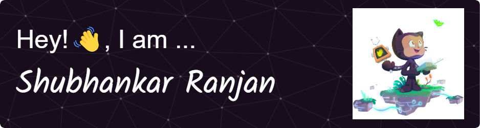

<!--  -->

<!--  -->

<h1></h1>

<!-- <h1 align="center">Hi 👋, I'm Shubhankar Ranjan</h1> -->
<h1 align="center">Web Development || Open Source || Dev Ops</h1>

  

  

  

- 👨‍💻 All of my projects are available at [https://github.com/Shubhankar-Ranjan](https://github.com/Shubhankar-Ranjan)

- 💬 Ask me about **Development and DSA**

- 📫 How to reach me **shubhankar515@gmail.com**

- 📄 Know about my experiences -> [My Resume](https://drive.google.com/file/d/1jx-wTztMpTRrpi_cBk0JFOF8AX0CpPRB/view)

- ⚡ Fun fact **I can code 🙂**

<h3 align="left">Connect with me:</h3>

<h3 align="left">Coding Profiles:</h3>

<h3 align="left">Languages and Tools:</h3>

                            

&nbsp;

